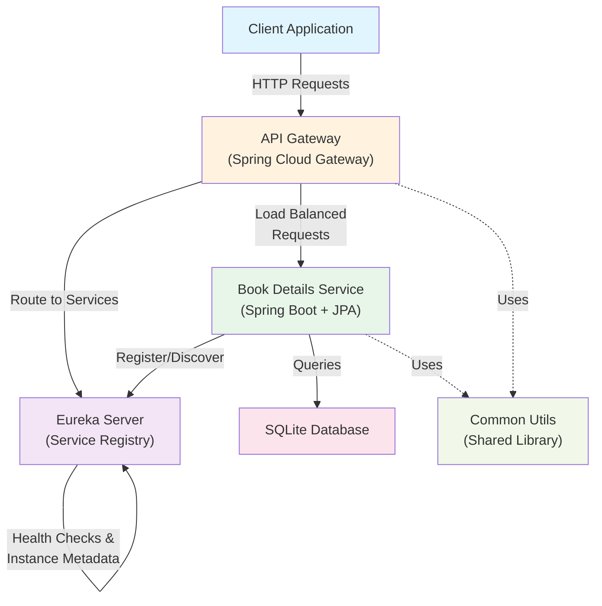

# LibraryApp

A simple Java microservice with SQLite backend

## System Architecture

### Architecture Components

- **API Gateway** - Entry point for all client requests using Spring Cloud Gateway with load balancing
- **Eureka Server** - Service registry and discovery for dynamic service management
- **Book Details Service** - Core microservice for book information management (Spring Boot + JPA + Hibernate)
- **SQLite Database** - Lightweight data persistence layer
- **Common Utils** - Shared library with reusable components across microservices

### Technology Stack

- Spring Boot 4.0.6
- Java 21
- Spring Cloud 2025.1.1
- Hibernate ORM
- SQLite Database
- Swagger/OpenAPI Documentation

## API Documentation

Swagger link:
http://localhost:8080/swagger-ui/index.html
